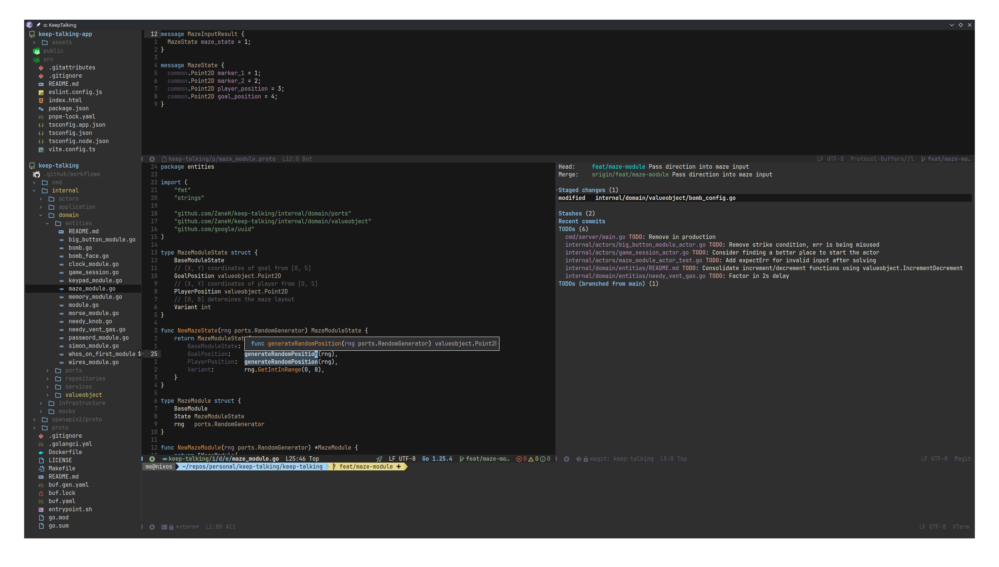

* .emacs.d config
** Dependencies
*npm*
- =copilot-language-server=
- =prettierd=
- =typescript=
- =typescript-language-server=

*other*
- =docker=
- =git=
- =go=
- =gopls=
- =latex=
- =python=
- =lsp-ltex-plus= (temporarily disabled)

** Preview

